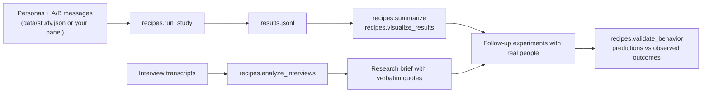

# Jev consumer research

Two Python cookbooks for comparing messages with synthetic personas and analyzing
interview transcripts using [TypeSafe's Jev](https://docs.typesafe.ai/api).
Both score live against the Jev API and ship with ready-to-run example inputs.

| Notebook | What it does |
| --- | --- |
| [Consumer focus groups](cookbooks/consumer_focus_groups.ipynb) | Define or import personas, score A/B messages, and compare results with Seaborn |
| [Interview analysis](cookbooks/interview_analysis.ipynb) | Evaluate sentiment, likely behavior, and research follow-ups with supporting quotes |

## Layout

- `cookbooks/` — the two self-contained notebooks
- `recipes/` — the same workflow as importable modules and command-line runners
- `data/` — example inputs: the study, personas, mapping, transcripts
- `docs/` — [LLM workflow notes](docs/LLM_WORKFLOW_NOTES.md) on methods and sources
- `tests/` — unit tests plus `fake_jev.py`, a deterministic stand-in for the API

How the pieces fit together:



## Start here

Use Python 3.11+ and install the dependencies:

```bash
python -m pip install -r requirements.txt
```

Put your API key in a `.env` file at the repo root (it is gitignored; never put
the key in a notebook cell or commit it):

```bash
echo 'TYPESAFE_API_KEY=your-key' > .env
```

The notebooks load `.env` automatically; the command-line runners read the
environment, so export the key first (`set -a; source .env; set +a`).

Open either notebook and **Restart Kernel and Run All**. Each includes its data
and helpers, so it also works when copied out of this repo. The persona notebook
includes a standalone dependency install command. Flowcharts use Mermaid;
[JupyterLab 4.1+](https://jupyterlab.readthedocs.io/en/4.1.x/getting_started/changelog.html#diagrams-in-markdown)
renders them in Markdown cells.

Runs save to fresh `notebook_runs/` or `interview_runs/` directories. The persona
notebook exports reports and PNG/SVG charts; the interview notebook exports a
research brief and the quotes behind its judgments.

## Customize a study

The persona example crosses four profiles with six messages: A/B variants of an
ad, product listing, and text-only website. It asks about sentiment, next action,
relevance, price objections, missing proof, and confusion.

Edit the notebook's study data or [study.json](data/study.json). Keep demographics
separate from shopping context: income is not a product budget, and missing
attributes should stay unknown. Update the study revision when inputs change.

To import a panel, set `PERSONA_FILE` in the notebook to CSV, JSON, or JSONL.
The adapter maps **destination field → source column/path**, keeps only selected
fields, and supports custom demographics and context. See
[example_personas.csv](data/example_personas.csv) and [persona_mapping.json](data/persona_mapping.json).
Declare CSV numeric types explicitly; this recipe requires `context.budget_usd`.
Python dictionaries are also supported through `adapt_personas()`.

For interviews, use the structure in [interviews_example.json](data/interviews_example.json)
or paste speaker-labeled text into the notebook. Interviews are one-on-one: each
transcript has a single participant plus a moderator. Edit `RESEARCH_ACTIONS`
to change the menu of proposed next steps.

## Run from the command line

The `recipes/` modules expose the same workflow. Run them with `-m` from the
repo root and keep generated files in `outputs/`:

```bash
mkdir -p outputs
python -m recipes.run_study --output outputs/results.jsonl
python -m recipes.summarize outputs/results.jsonl
python -m recipes.summarize outputs/results.jsonl --group-by context.purchase_stage --diagnostics
python -m recipes.run_study --mask-demographics --output outputs/masked.jsonl
python -m recipes.summarize outputs/results.jsonl --masked outputs/masked.jsonl
python -m recipes.analyze_interviews data/interviews_example.json --output outputs/interviews.jsonl
python -m recipes.validate_behavior data/validation_example.json
```

Import a panel with the supplied mapping:

```bash
python -m recipes.persona_adapter data/example_personas.csv data/persona_mapping.json --revision my-panel-v1 --output outputs/study.json
python -m recipes.run_study --study outputs/study.json --output outputs/imported.jsonl
python -m recipes.summarize outputs/imported.jsonl --group-by profession
```

Output files are never overwritten. Choose a new path when repeating a run.

## Request limits and data handling

The default persona notebook makes 48 requests: 24 with demographics and 24
without. Interview analysis makes one request per interview.
`MAX_CALLS` / `--max-calls` limits requests, not spending. Live calls send the
supplied inputs to TypeSafe; use data you have permission to share.

Runners retain partial results, stop on authentication/rate/overload errors, and
do not retry automatically.

## Read the results

- A/B comparisons use complete pairs within the same profile and surface. Failed
  requests remain `unavailable`; they are distinct from an `unknown` answer.
- Seaborn charts show model probabilities and per-profile differences.
- Removing demographics tests the model's sensitivity to the demographic block.
- Interview quotes are retrieved verbatim from the transcript.

Jev returns typed scores directly, avoiding prose generation and rescoring when
only numbers are needed. LLMs can also produce scores directly; cost and accuracy
advantages require a matched comparison. See [LLM workflow notes](docs/LLM_WORKFLOW_NOTES.md)
for documented methods, sources, and research-design guidance.

## Validate against real outcomes

The last step in the loop never calls Jev. `recipes.validate_behavior` takes
predictions that were frozen before the outcomes existed — for example,
simulated engage scores mapped to the arms of a real ad test — plus the
observed 0/1 results (`data/validation_example.json` shows the format), and
reports:

- **Brier score**: the average squared gap between each predicted probability
  and what actually happened. 0 is perfect; always guessing 50/50 scores 0.25,
  and confident misses cost the most.
- **Baseline comparison**: the same score computed as if you had predicted your
  historical base rate every time. A positive `improvement_over_baseline` means
  the simulation told you something the base rate alone didn't.
- **Calibration bins**: rows grouped by predicted probability, with the average
  prediction shown next to the observed rate in each group. When they match, a
  0.4 means the event really happens about 40% of the time; when they don't,
  trust the ranking of messages more than the raw probabilities.

## Development

```bash
MPLBACKEND=Agg python -m unittest discover -s tests -v
```

Tests cover input mapping, score validation, incomplete A/B pairs, plots,
transcript evidence, mocked API failures, and standalone execution of both
notebooks. The suite never calls the live API: `tests/fake_jev.py` answers with
deterministic canned scores.
Notebook helpers intentionally mirror the modules so each notebook stays portable.
Commit notebooks with cleared outputs and execution counts.

## Future: static ad images

Once TypeSafe releases a multimodal model that understands images, we can feed
static ads alongside profiles to evaluate imagery, layout, and copy together.
The current adapter accepts text only.
